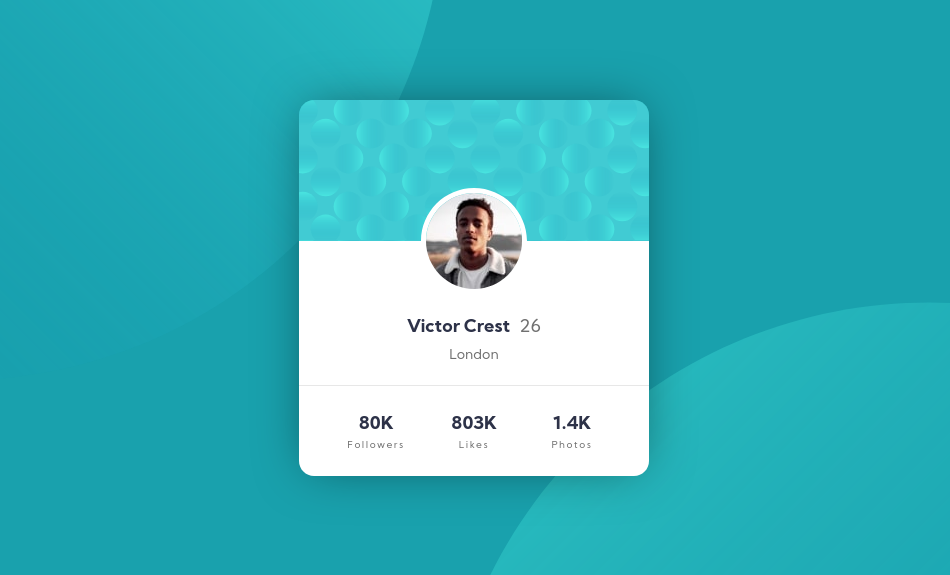

# Profile card component
This is a challenge project from [Frontend Mentor](https://www.frontendmentor.io/challenges/profile-card-component-cfArpWshJ).

The goal was to build a profile component as close to the provided design by following the specifications.

## Running the project
----
* Clone this repo: `git clone git@github.com:ThatJohn/profile-card-component.git`.
* cd into its directory: `profile-card-component`.
* Install dependencies: `npm install`.
* run `gulp`.
* start editing.